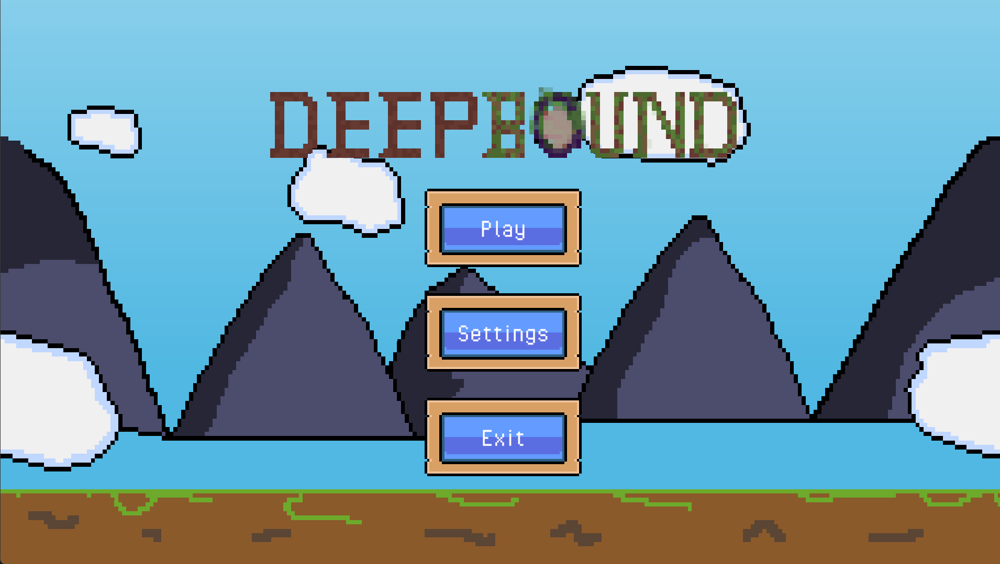
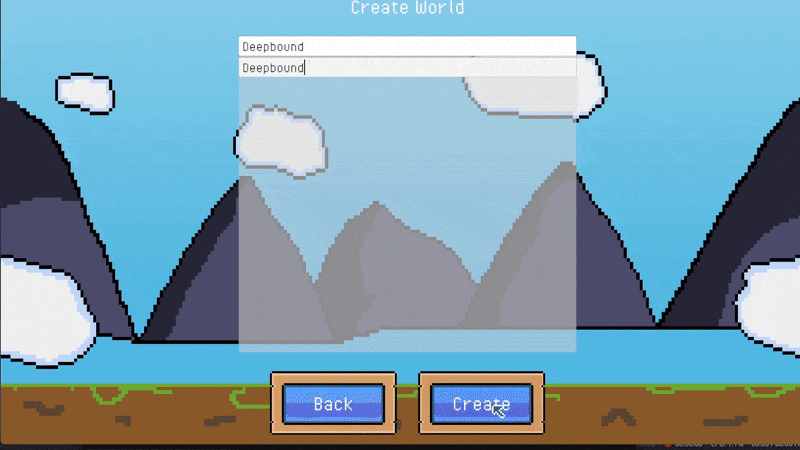
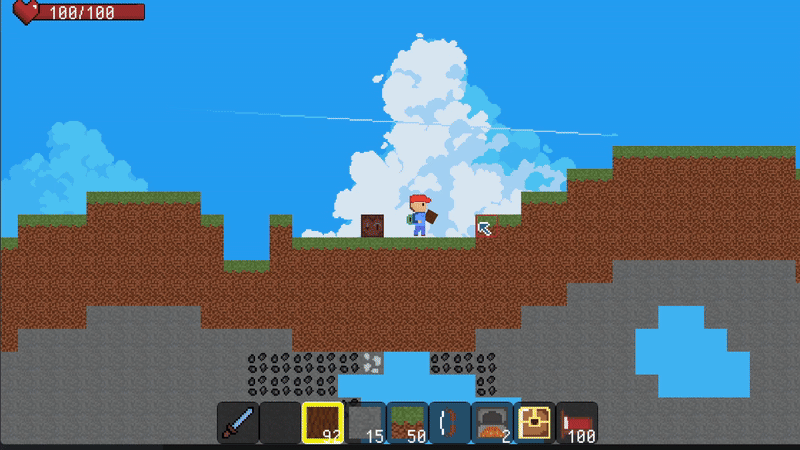
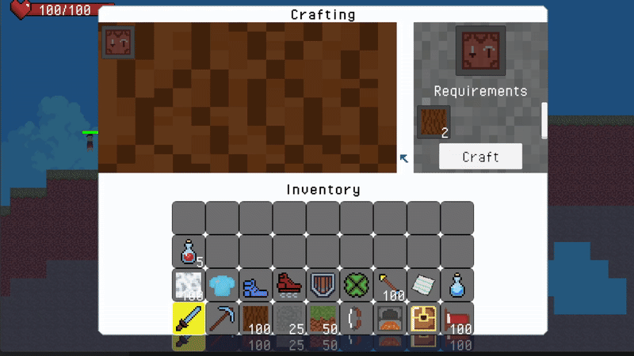

# 🚀 DeepBound — A Modular 2D Sandbox Engine

**DeepBound** is a fully custom-built **2D sandbox engine** created in Unity (C#).  
It focuses heavily on **systems programming**, **procedural world simulation**, and **high-performance custom rendering**.

This project is designed as my flagship portfolio piece showcasing my work as a:

- 🎯 Systems Programmer  
- 🎯 Gameplay Technology Developer  
- 🎯 Data & Architecture Engineer  

---

## 🛠️ Tech Stack
- **Unity (C#)**
- **Custom Mesh Renderer**
- **JSON Data Persistence**
- **Event-Driven Architecture**
- **Object Pooling**
- **Data-Driven Items & Blocks**

---

# 🎥 Live Technical Demos

## 🌍 Procedural Generation & Custom Mesh Rendering
| Procedural Generation | Custom Mesh Renderer | Save / Load System |
| :---: | :---: | :---: |
|  |  |  |
| Procedurally generated terrain with noise-based biomes. | World blocks rendered using **custom mesh pipeline** for performance, avoiding per-block GameObjects. | Full JSON serialization of world, player, inventory, and entities. |

## 🎒 Inventory, Items & Crafting
| Inventory System | Workbench / Multi-Stage Crafting |
| :---: | :---: |
|  |
| Drag & drop inventory, item stacking, and data-driven items. | Crafting system with specialized stations (e.g., furnace/workbench). |

---

# 🔧 Technical Architecture Breakdown

### 🔹 Procedural Generation
- Noise-driven terrain generation  
- Worlds rendered using **combined meshes** (no per-block GameObjects)  
- Supports varied terrain and biomes efficiently  

### 🔹 Custom Mesh Rendering Pipeline
- World blocks are combined into meshes for efficient rendering  
- No per-block SpriteRenderer usage  
- Significantly improved performance even in dense areas  

### 🔹 Save / Load System
- JSON serialization of:
  - `WorldData`
  - `PlayerData`
  - `InventoryData`
  - Entity states  
- Full, deterministic recreation of the world  
- Optimized diff-based save architecture  

### 🔹 Modular Systems Architecture
- EventBus-driven communication  
- Data-driven block + item definitions  
- Decoupled subsystems (inventory, rendering, AI, worldgen, etc.)  
- Supports extension without touching core engine code  

---

# 🌱 Current & Future Goals
- ➤ Implementing **A\*** Pathfinding  
- ➤ Building a full **Behavior Tree** AI system  
- ➤ World chunk streaming & LOD systems  
- ➤ Better biomes + terrain layers  

---

# 📂 Project Structure
DeepBound/
│
├── Assets/ ← Game & engine source code
├── ProjectSettings/ ← Unity project configuration
├── Packages/ ← Package registry
└── Media/ ← GIFs & screenshots used in README

---

# 👥 Contributors

A huge thanks to the people who helped shape this project:

### **Furkan Kırat** — *Lead Developer / Systems Programmer*  
Designed the engine architecture, world generation, rendering pipeline, inventory, crafting, save/load, and core systems.

### **Halil Efe Çelik** — *Art & Visual Assistance*  
Contributed to various visuals, UI enhancements, stylization passes, and animation refinements.

---

# 📜 License
MIT License — free to learn from and modify.

---
# **Fonts**  
- Pixel Operator (CC0/Public Domain) used for UI and title text.
